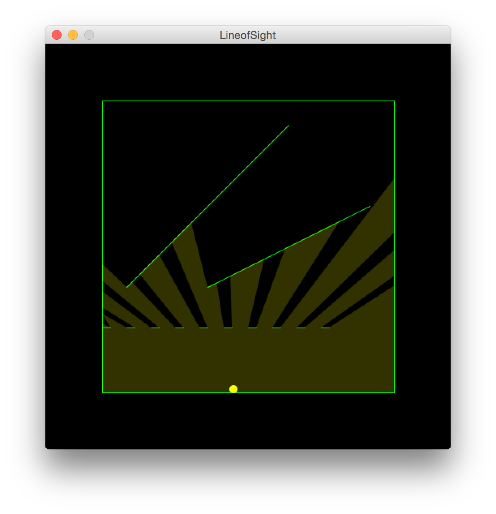

# LineofSight
Processing Script that creates a dynamic 2D field of sight based upon the mouse location and opaque walls

Inspired by RedBlobGames: http://www.redblobgames.com/articles/visibility/

 
